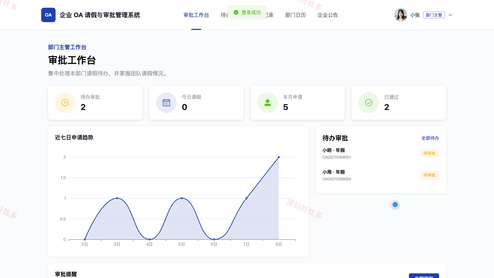
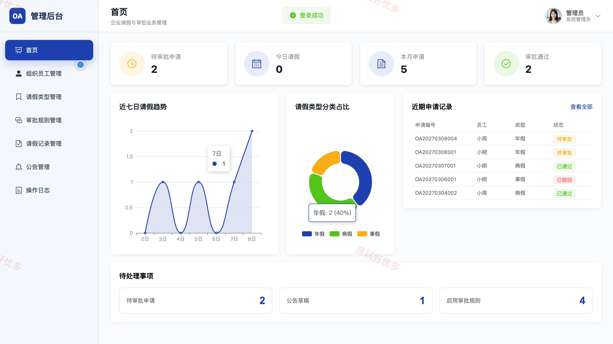
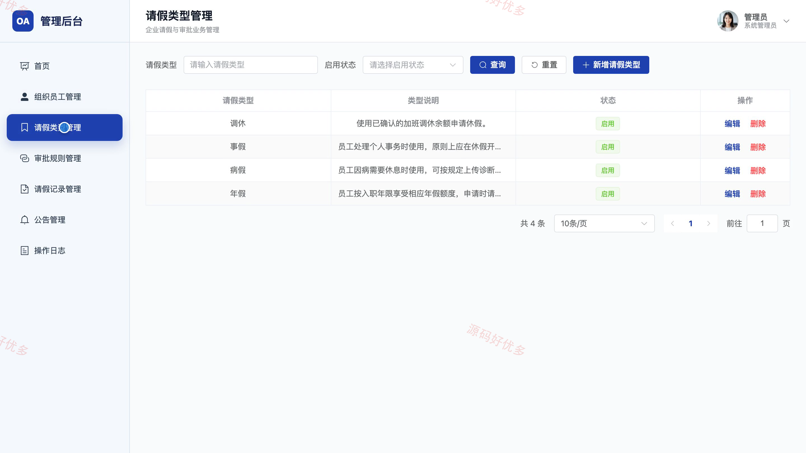
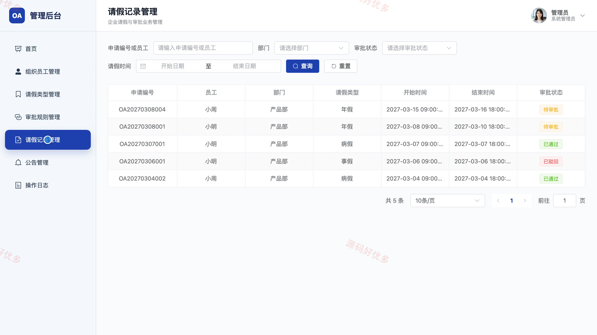

# bs080A
bs080A企业OA请假与审批管理系统
## 源码问题查看主页咨询

### 一、关键词
企业OA请假审批、员工休假管理、流程审批、考勤协同、办公自动化

### 二、作品包含
源码+数据库+万字设计文档+PPT+全套环境和工具资源+本地部署教程

### 三、项目技术
前端技术： Html、Css、Js、Vue3.4、Element-Plus
后端技术：Java、SpringBoot3.2.0、MyBatis-Plus

### 四、运行环境（以下版本亲测，其他版本兼容性请自行测试）
开发工具：IDEA/eclipse + VSCODE

数据库：MySQL5.7+（共13张表）

数据库管理工具：Navicat10以上版本

环境配置软件： JDK17 + Maven

前端Nodejs：16+

浏览器：谷歌浏览器

### 五、项目介绍
项目编号：bs080A

企业OA请假与审批管理系统面向员工、部门主管和系统管理员，串联请假类型选择、申请填报、审批处理、进度跟踪和消息通知，并提供组织员工、审批规则、企业公告与操作日志等后台管理能力。

角色：员工、部门主管、系统管理员

员工功能：查看请假工作台、选择请假类型、提交请假申请、查询个人申请、跟踪审批进度、查看消息通知、浏览企业公告、维护账户资料与修改密码。

部门主管功能：查看审批工作台、查询待办审批、审批请假申请、查询审批记录、查看部门请假日历、浏览企业公告。

系统管理员功能：查看请假统计看板、管理组织员工账号、管理请假类型、管理审批规则、查询全公司请假记录、管理企业公告、查询操作日志、维护管理员账户。

### 六、运行截图

